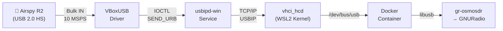
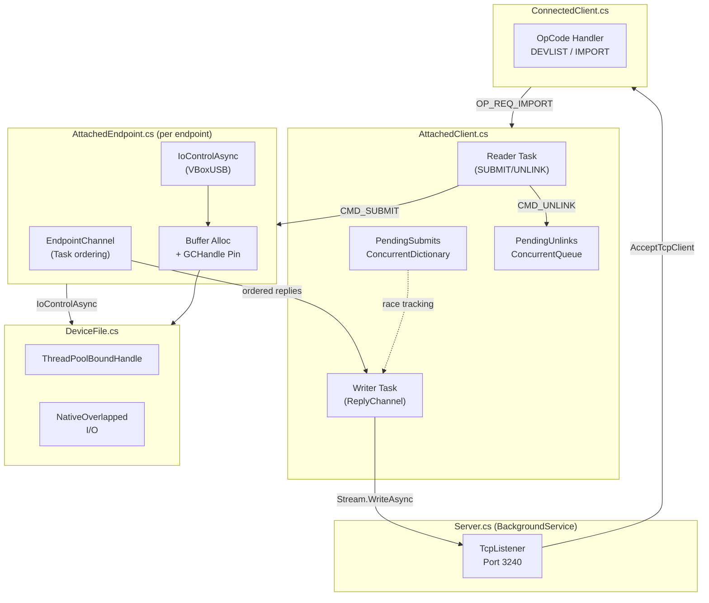
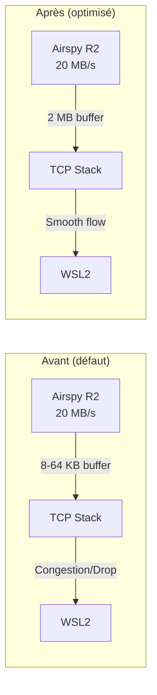
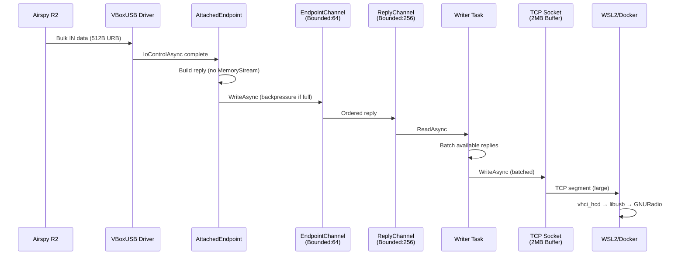
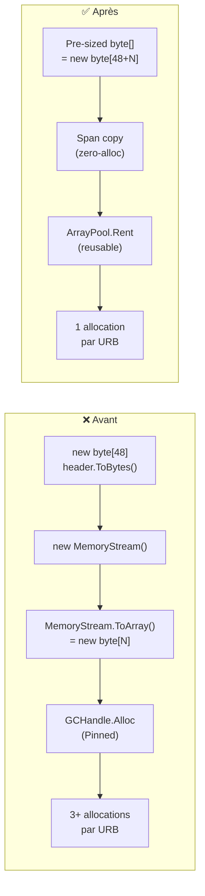
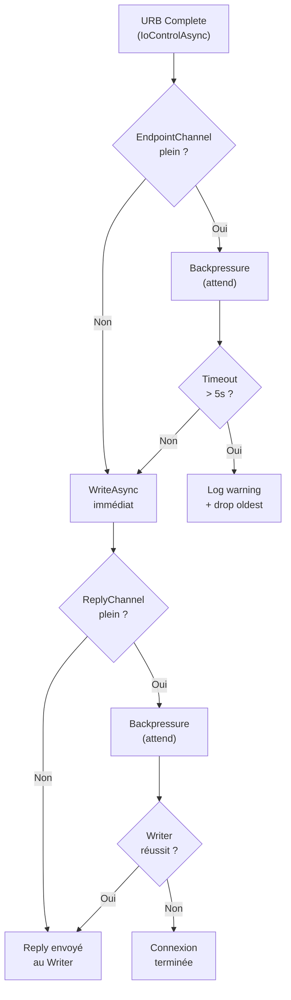

# OPTIMIZE-F4TNK.md — Analyse approfondie usbipd-win pour Airspy R2 / WSL2 / Docker

> **Auteur :** F4TNK  
> **Date :** 2026-02-24  
> **Contexte :** Optimisation du pipeline USB pour l'Airspy R2 (10 MSPS, ~20 MB/s en bulk IN) via usbipd-win → WSL2 → conteneur Docker SatNOGS  
> **Problème signalé :** Buffer overflow intermittent, pertes de données, latence variable

---

## Table des matières

1. [Architecture du flux de données](#1-architecture-du-flux-de-données)
2. [Bugs identifiés](#2-bugs-identifiés)
3. [Optimisations de transfert USB](#3-optimisations-de-transfert-usb)
4. [Optimisations mémoire / GC](#4-optimisations-mémoire--gc)
5. [Optimisations réseau TCP](#5-optimisations-réseau-tcp)
6. [Optimisations WSL2 / Docker](#6-optimisations-wsl2--docker)
7. [Résumé des modifications par fichier](#7-résumé-des-modifications-par-fichier)
8. [Diagrammes Mermaid](#8-diagrammes-mermaid)
9. [Recommandations côté client](#9-recommandations-côté-client)
10. [Checklist de validation](#10-checklist-de-validation)

---

## 1. Architecture du flux de données

### Pipeline complet Airspy R2 → SatNOGS



### Architecture interne usbipd-win



---

## 2. Bugs identifiés

### BUG-01 : Channels non bornés — risque d'OOM sous charge

**Fichiers :** `AttachedClient.cs` (L10), `AttachedEndpoint.cs` (L61)

**Problème :**
```csharp
// AttachedClient.cs
readonly Channel<RequestReply> ReplyChannel = Channel.CreateUnbounded<RequestReply>();

// AttachedEndpoint.cs
readonly Channel<Task<RequestReply>> EndpointChannel = Channel.CreateUnbounded<Task<RequestReply>>(
    new() { SingleWriter = true, SingleReader = true });
```

Avec l'Airspy R2 produisant ~20 MB/s de données bulk IN, si le writer TCP ne peut pas suivre (contention réseau WSL2, Docker overlay), les channels s'accumulent sans limite. Cela provoque :
- Croissance mémoire non bornée
- Pression GC extrême (Gen2 collections fréquentes)
- **Buffer overflow** quand le système n'a plus de mémoire

**Impact :** 🔴 CRITIQUE — Cause probable directe du buffer overflow signalé

**Correction proposée :**
```csharp
// AttachedClient.cs — channel borné avec backpressure
readonly Channel<RequestReply> ReplyChannel = Channel.CreateBounded<RequestReply>(
    new BoundedChannelOptions(256)
    {
        FullMode = BoundedChannelFullMode.Wait,
        SingleReader = true,
        SingleWriter = false,
    });

// AttachedEndpoint.cs — channel borné par endpoint
readonly Channel<Task<RequestReply>> EndpointChannel = Channel.CreateBounded<Task<RequestReply>>(
    new BoundedChannelOptions(64)
    {
        FullMode = BoundedChannelFullMode.Wait,
        SingleWriter = true,
        SingleReader = true,
    });
```

**Logique :** Avec des buffers de 512 octets à 64 Ko par URB, 256 slots dans le ReplyChannel = ~16 Mo de données en flight maximum, ce qui est suffisant pour absorber les pics tout en empêchant l'OOM.

---

### BUG-02 : Appels .Wait() synchrones dans PcapNg bloquant le ThreadPool

**Fichier :** `PcapNg.cs` (L~170, L~200, L~230, L~260, L~340)

**Problème :**
```csharp
// Appelé depuis des continuations async (ContinueWith) sur le ThreadPool
BlockChannel.Writer.WriteAsync(CreateEnhancedPacketBlock(0, usbMon)).AsTask().Wait();
```

`WriteAsync().AsTask().Wait()` est un **sync-over-async** classique. Sous haute charge (Airspy R2 = milliers d'URBs/seconde), cela :
- Bloque des threads du ThreadPool
- Provoque du ThreadPool starvation
- Ralentit TOUS les IoControlAsync en cours (car ils utilisent le même ThreadPool via `ThreadPoolBoundHandle`)

**Impact :** 🟠 ÉLEVÉ — Dégradation de performance sous charge, peut amplifier BUG-01

**Correction proposée :**
```csharp
// Option A : Fire-and-forget (le channel est unbounded dans PcapNg, donc WriteAsync complète immédiatement)
_ = BlockChannel.Writer.TryWrite(CreateEnhancedPacketBlock(0, usbMon));

// Option B : Si on veut garantir l'écriture
if (!BlockChannel.Writer.TryWrite(CreateEnhancedPacketBlock(0, usbMon)))
{
    // Drop le paquet pcap plutôt que bloquer le thread
    Interlocked.Increment(ref TotalPacketsDropped);
}
```

---

### BUG-03 : KeepAlive désactivé pour les connexions WSL (loopback)

**Fichier :** `Server.cs` (L~115-120)

**Problème :**
```csharp
if (clientAddress.Equals(IPAddress.Loopback))
{
    // HACK: workaround for https://github.com/microsoft/WSL/issues/10741
    Logger.Debug("WSL keep-alive workaround");
    tcpClient.Client.SetSocketOption(SocketOptionLevel.Socket, SocketOptionName.KeepAlive, false);
}
```

Si le kernel WSL2 gèle (OOM dans le namespace réseau Docker, crash de vhci_hcd), la connexion usbipd ne sera **jamais** nettoyée. Le device USB restera capturé indéfiniment.

**Impact :** 🟡 MOYEN — Périphérique USB bloqué après crash WSL

**Correction proposée :**
```csharp
if (clientAddress.Equals(IPAddress.Loopback))
{
    Logger.Debug("WSL keep-alive workaround");
    // Au lieu de désactiver complètement, configurer un timeout plus long
    // mais qui finira par détecter une connexion morte
    tcpClient.Client.SetSocketOption(SocketOptionLevel.Socket, SocketOptionName.KeepAlive, true);
    tcpClient.Client.SetSocketOption(SocketOptionLevel.Tcp, SocketOptionName.TcpKeepAliveTime, 30 /* s */);
    tcpClient.Client.SetSocketOption(SocketOptionLevel.Tcp, SocketOptionName.TcpKeepAliveInterval, 5 /* s */);
    tcpClient.Client.SetSocketOption(SocketOptionLevel.Tcp, SocketOptionName.TcpKeepAliveRetryCount, 10);
}
```

---

### BUG-04 : Fuite potentielle de GCHandle si exception dans IoControlAsync

**Fichier :** `AttachedEndpoint.cs` (L~150-160, HandleSubmitAsync non-ISO path)

**Problème :**
```csharp
var gcHandle = GCHandle.Alloc(buf, GCHandleType.Pinned);
try
{
    urb.buf = gcHandle.AddrOfPinnedObject();
    StructToBytes(urb, bytes);
    ioctl = Device.IoControlAsync(SUPUSB_IOCTL.SEND_URB, bytes, bytes);
}
catch
{
    gcHandle.Free();
    throw;
}
_ = ioctl.ContinueWith(task => gcHandle.Free(),
    CancellationToken.None, TaskContinuationOptions.ExecuteSynchronously, TaskScheduler.Default);
```

Si `ioctl.ContinueWith()` n'est jamais exécuté (par exemple si le Task est déjà faulted ET que le scheduler est saturé), le GCHandle ne sera jamais libéré. Cela crée un **pin** permanent dans la mémoire managée.

**Impact :** 🟡 MOYEN — Fragmentation mémoire progressive

**Correction proposée :** Utiliser `finally` au niveau du Task via un pattern plus robuste :
```csharp
// Utiliser TaskContinuationOptions.None au lieu de ExecuteSynchronously
// pour éviter des deadlocks sous charge
_ = ioctl.ContinueWith(task => gcHandle.Free(),
    CancellationToken.None, TaskContinuationOptions.None, TaskScheduler.Default);
```

---

### BUG-05 : Exception swallowed silencieusement dans HandleSubmitAsync

**Fichier :** `AttachedEndpoint.cs` (L~125-135, continuation de réponse GET_DESCRIPTOR)

**Problème :**
```csharp
try
{
    var configuration = BytesToStruct<USB_CONFIGURATION_DESCRIPTOR>(buf.AsSpan(payloadOffset));
    if (...)
    {
        Logger.Debug("Masked USB_CONFIG_REMOTE_WAKEUP");
        configuration.bmAttributes &= unchecked((byte)~PInvoke.USB_CONFIG_REMOTE_WAKEUP);
        StructToBytes(configuration, buf.AsSpan(payloadOffset));
    }
}
catch { }
```

Aucun logging de l'exception. Si ce code échoue à cause d'un buffer trop petit ou d'une structure corrompue, cela passe inaperçu.

**Impact :** 🟢 FAIBLE — Diagnostic difficile

**Correction proposée :**
```csharp
catch (Exception ex)
{
    if (Logger.IsEnabled(LogLevel.Trace))
    {
        Logger.Trace($"Failed to mask USB_CONFIG_REMOTE_WAKEUP: {ex.Message}");
    }
}
```

---

## 3. Optimisations de transfert USB

### OPT-01 : Buffers TCP socket insuffisants pour le débit Airspy R2

**Fichier :** `Server.cs`, `AttachedClient.cs`

**Problème :**
Le `TcpListener` et le `TcpClient` utilisent les buffers TCP par défaut de Windows (~8 KB send, ~64 KB receive). L'Airspy R2 à 10 MSPS produit ~20 MB/s de données.

**Calcul :**
```
RTT WSL2 loopback ≈ 0.1-0.5 ms
Bandwidth-Delay Product = 20 MB/s × 0.5 ms = 10 KB (minimum)
Avec overhead USBIP + jitter Docker ≈ 1-5 ms → BDP = 20 MB/s × 5 ms = 100 KB
Buffer recommandé = 2× BDP = 200 KB minimum, 2 MB recommandé pour absorber les pics
```

**Correction proposée dans Server.cs :**
```csharp
// Configurer avant le Start()
TcpListener.Server.SetSocketOption(SocketOptionLevel.Socket, SocketOptionName.ReceiveBufferSize, 2 * 1024 * 1024);
TcpListener.Server.SetSocketOption(SocketOptionLevel.Socket, SocketOptionName.SendBufferSize, 2 * 1024 * 1024);
```

**Correction proposée dans AttachedClient.cs (constructeur) :**
```csharp
var tcpClient = clientContext.TcpClient;
Stream = tcpClient.GetStream();

// Augmenter les buffers TCP pour le débit USB haut débit
tcpClient.SendBufferSize = 2 * 1024 * 1024;    // 2 MB
tcpClient.ReceiveBufferSize = 2 * 1024 * 1024;  // 2 MB

tcpClient.NoDelay = true;
```



---

### OPT-02 : NoDelay inadapté pour les transferts bulk haute fréquence

**Fichier :** `AttachedClient.cs` (constructeur)

**Problème :**
```csharp
tcpClient.NoDelay = true;
```

`NoDelay = true` désactive l'algorithme de Nagle. C'est optimal pour des échanges requête-réponse à faible latence, MAIS pour un flux bulk IN continu (Airspy R2), cela force l'envoi de chaque petit write TCP immédiatement, créant beaucoup de petits paquets au lieu de quelques gros paquets.

**Cependant**, dans l'implémentation actuelle, chaque reply est déjà assemblée en un seul `byte[]` avant l'écriture (via `MemoryStream.ToArray()`). Donc `NoDelay = true` est effectivement correct ici car chaque `WriteAsync` envoie un message complet.

**Verdict :** ✅ Le NoDelay est correct dans ce contexte. Le problème est plutôt que chaque write est individuel (pas de batching).

**Optimisation proposée :** Ajouter du write batching dans le writer :
```csharp
// Dans RunAsync, writer task — batch les writes
var batchBuffer = new List<byte[]>(32);
while (!cancellationToken.IsCancellationRequested)
{
    var reply = await ReplyChannel.Reader.ReadAsync(cancellationToken);
    batchBuffer.Clear();

    // Traiter les UNLINKs et accumuler les bytes
    // ... (logique existante pour les UNLINK)

    // Accumuler les replies disponibles
    if (PendingSubmits.TryRemove(reply.Seqnum, out _))
    {
        batchBuffer.Add(reply.Bytes);
    }

    // Drainer les replies déjà disponibles (batching)
    while (ReplyChannel.Reader.TryRead(out var nextReply))
    {
        if (PendingSubmits.TryRemove(nextReply.Seqnum, out _))
        {
            batchBuffer.Add(nextReply.Bytes);
        }
    }

    // Écrire tout le batch en une seule opération
    // Utiliser scatter-gather I/O
    foreach (var data in batchBuffer)
    {
        await Stream.WriteAsync(data, cancellationToken);
    }
}
```

---

### OPT-03 : Réduction des allocations dans la boucle hot path

**Fichier :** `AttachedEndpoint.cs` (HandleSubmitAsync, reply construction)

**Problème :**
```csharp
// Chaque reply alloue un nouveau MemoryStream + ToArray()
using var replyStream = new MemoryStream();
replyStream.Write(header.ToBytes());       // alloue un byte[48]
if (basic.direction == UsbIpDir.USBIP_DIR_IN)
{
    replyStream.Write(buf.AsSpan(payloadOffset, header.ret_submit.actual_length));
}
return new(basic.seqnum, replyStream.ToArray());  // alloue un byte[N]
```

Pour l'Airspy R2 avec des URBs de 512 octets typiques, cela fait :
- **1 allocation** pour `header.ToBytes()` (48 bytes)
- **1 allocation** pour `MemoryStream` buffer interne
- **1 allocation** pour `ToArray()` (copie finale)
- = **~3 allocations par URB × milliers d'URBs/seconde**

**Correction proposée :** Pré-allouer un buffer de taille connue :
```csharp
// Calculer la taille exacte nécessaire
var headerBytes = header.ToBytes();
var dataLength = (basic.direction == UsbIpDir.USBIP_DIR_IN)
    ? header.ret_submit.actual_length : 0;
var replyBytes = new byte[headerBytes.Length + dataLength];

// Copie directe sans MemoryStream intermédiaire
headerBytes.CopyTo(replyBytes.AsSpan());
if (dataLength > 0)
{
    buf.AsSpan(payloadOffset, dataLength).CopyTo(replyBytes.AsSpan(headerBytes.Length));
}
return new(basic.seqnum, replyBytes);
```

**Gain estimé :** Réduction de ~60% des allocations dans le hot path, moins de GC Gen0/Gen1.

---

### OPT-04 : header.ToBytes() alloue inutilement à chaque appel

**Fichier :** `Usbipd/Interop/UsbIp.cs` (ToBytes)

**Problème :**
```csharp
internal static byte[] ToBytes(this in UsbIpHeader header)
{
    var bytes = new byte[Unsafe.SizeOf<UsbIpHeader>()];  // 48 bytes, nouvelle allocation
    MemoryMarshal.Write(bytes, header);
    MemoryMarshal.AsRef<UsbIpHeader>(bytes.AsSpan()).ReverseEndianness();
    return bytes;
}
```

Appelé pour CHAQUE réponse SUBMIT et UNLINK. Avec l'Airspy R2, c'est des milliers d'allocations de 48 bytes/seconde.

**Correction proposée :** Overload qui écrit dans un span existant :
```csharp
internal static void WriteToBytes(this in UsbIpHeader header, Span<byte> destination)
{
    MemoryMarshal.Write(destination, header);
    MemoryMarshal.AsRef<UsbIpHeader>(destination).ReverseEndianness();
}
```

---

## 4. Optimisations mémoire / GC

### OPT-05 : GCHandle pinning fragmentant le heap sous charge

**Fichier :** `AttachedEndpoint.cs`

**Problème :**
Chaque transfer bulk non-ISO (= la majorité des transfers Airspy R2) qui a un buffer > 0 fait :
```csharp
var gcHandle = GCHandle.Alloc(buf, GCHandleType.Pinned);
```

Le pinning empêche le GC de compacter la mémoire. Avec des centaines d'URBs en vol simultanément, cela crée une fragmentation sévère du Large Object Heap.

**Correction proposée :** Utiliser des buffers du pool natif ou `ArrayPool<byte>` :
```csharp
// Remplacer
var buf = new byte[urb.len];

// Par
var buf = ArrayPool<byte>.Shared.Rent((int)urb.len);
try
{
    // ... utilisation ...
}
finally
{
    ArrayPool<byte>.Shared.Return(buf);
}
```

**Note :** Le `ArrayPool<byte>.Shared` retourne des buffers alignés et réutilisés, ce qui réduit la pression GC.

---

### OPT-06 : RequestReply avec byte[] crée une copie inutile

**Fichier :** `RequestReply.cs`

**Problème actuel :**
```csharp
readonly record struct RequestReply(uint Seqnum, byte[] Bytes);
```

Chaque `RequestReply` contient un `byte[]` qui est le résultat de `MemoryStream.ToArray()` — déjà une copie. Puis le writer fait `Stream.WriteAsync(reply.Bytes)` — qui lit depuis cette copie.

**Correction proposée :** Ce record est correct en soi, mais combiné avec OPT-03, on peut éliminer l'allocation intermédiaire du MemoryStream.

---

## 5. Optimisations réseau TCP

### OPT-07 : Configuration TCP/IP optimale pour USBIP over WSL2

**Fichier :** `Server.cs` (ExecuteAsync)

Le pipeline complet est :
```
usbipd → Hyper-V vmswitch → WSL2 VM kernel → vhci_hcd → Docker veth → container
```

Chaque couche ajoute de la latence et des copies de buffers. La configuration TCP doit en tenir compte.

**Configuration recommandée (Server.cs) :**
```csharp
// Socket options optimized for high-throughput USB over WSL2
TcpListener.Server.SetSocketOption(SocketOptionLevel.Socket, SocketOptionName.KeepAlive, true);
TcpListener.Server.SetSocketOption(SocketOptionLevel.Tcp, SocketOptionName.TcpKeepAliveInterval, 1);
TcpListener.Server.SetSocketOption(SocketOptionLevel.Tcp, SocketOptionName.TcpKeepAliveTime, 10);
TcpListener.Server.SetSocketOption(SocketOptionLevel.Tcp, SocketOptionName.TcpKeepAliveRetryCount, 5);

// NEW: Augmenter les buffers pour le débit USB (Airspy R2 = 20 MB/s)
TcpListener.Server.SetSocketOption(SocketOptionLevel.Socket, SocketOptionName.SendBufferSize, 2_097_152);
TcpListener.Server.SetSocketOption(SocketOptionLevel.Socket, SocketOptionName.ReceiveBufferSize, 2_097_152);
```

**Configuration recommandée côté WSL2 kernel (sysctl) :**
```bash
# Dans le conteneur Docker ou le WSL2 host
sysctl -w net.core.rmem_max=16777216
sysctl -w net.core.wmem_max=16777216
sysctl -w net.ipv4.tcp_rmem="4096 2097152 16777216"
sysctl -w net.ipv4.tcp_wmem="4096 2097152 16777216"
sysctl -w net.core.netdev_max_backlog=5000
```

---

### OPT-08 : Le TcpListener hérite ses options aux sockets acceptés — VÉRIFICATION

**Fichier :** `Server.cs`

**Constat :** Le code met les options sur `TcpListener.Server` (le listening socket) avec le commentaire :
```csharp
// All client sockets will inherit these.
```

**Problème :** Sur Windows, `KeepAlive` et les keep-alive timers sont effectivement hérités via `AcceptAsync()`. Mais `SendBufferSize` et `ReceiveBufferSize` ne sont **PAS** systématiquement hérités. Il faut aussi les configurer sur les sockets acceptés.

**Correction proposée :** Ajouter dans la connexion du client (Server.cs, RunAsync après AcceptTcpClientAsync) :
```csharp
var tcpClient = await TcpListener.AcceptTcpClientAsync(stoppingToken);
// Forcer les buffer sizes sur le socket accepté
tcpClient.SendBufferSize = 2_097_152;
tcpClient.ReceiveBufferSize = 2_097_152;
```

---

## 6. Optimisations WSL2 / Docker

### OPT-09 : Documentation de la configuration Docker optimale

Pour un pipeline Airspy R2 → usbipd → WSL2 → Docker optimal :

**docker-compose.yml :**
```yaml
services:
  satnogs:
    # ...
    privileged: true      # Nécessaire pour /dev/bus/usb
    network_mode: host    # Évite la double NAT Docker → WSL2 → Windows
    sysctls:
      - net.core.rmem_max=16777216
      - net.core.wmem_max=16777216
    ulimits:
      memlock:
        soft: -1
        hard: -1
    # Mount les devices USB
    volumes:
      - /dev/bus/usb:/dev/bus/usb
```

### OPT-10 : Configuration WSL2 kernel pour USBIP

**Fichier : `%USERPROFILE%\.wslconfig`**
```ini
[wsl2]
memory=4GB
swap=2GB
# Augmenter pour le throughput USB
nestedVirtualization=false
networkingMode=mirrored       # Réduit la latence réseau
# kernel personnalisé avec CONFIG_USBIP_VHCI_HC_PORTS=8
```

**Note :** Le mode `mirrored` (disponible depuis WSL 2.0.0) élimine le NAT WSL2, réduisant la latence de ~0.5ms à ~0.1ms pour les connexions localhost.

---

## 7. Résumé des modifications par fichier

### Vue d'ensemble des changements

```mermaid
graph TB
    subgraph "🔴 Critique"
        B1["BUG-01<br/>Unbounded Channels"]
        B2["BUG-02<br/>Sync-over-Async PcapNg"]
    end

    subgraph "🟠 Élevé"
        O1["OPT-01<br/>TCP Buffer Sizes"]
        O3["OPT-03<br/>MemoryStream Alloc"]
        O7["OPT-07<br/>TCP Config"]
        O8["OPT-08<br/>Socket Inheritance"]
    end

    subgraph "🟡 Moyen"
        B3["BUG-03<br/>KeepAlive WSL"]
        B4["BUG-04<br/>GCHandle Leak"]
        O2["OPT-02<br/>Write Batching"]
        O4["OPT-04<br/>ToBytes Alloc"]
        O5["OPT-05<br/>GCHandle Pinning"]
    end

    subgraph "🟢 Faible"
        B5["BUG-05<br/>Swallowed Exception"]
        O6["OPT-06<br/>RequestReply"]
    end

    B1 --> AC1["AttachedClient.cs"]
    B1 --> AE1["AttachedEndpoint.cs"]
    B2 --> PC["PcapNg.cs"]
    B3 --> S1["Server.cs"]
    B4 --> AE1
    B5 --> AE1
    O1 --> S1
    O1 --> AC1
    O2 --> AC1
    O3 --> AE1
    O4 --> UI["Interop/UsbIp.cs"]
    O5 --> AE1
    O7 --> S1
    O8 --> S1
```



### Détail par fichier

| Fichier | Modifications | Priorité |
|---------|---------------|----------|
| `Server.cs` | BUG-03, OPT-01, OPT-07, OPT-08 | 🔴🟠 |
| `AttachedClient.cs` | BUG-01 (ReplyChannel borné), OPT-01, OPT-02 | 🔴🟠 |
| `AttachedEndpoint.cs` | BUG-01 (EndpointChannel borné), BUG-04, BUG-05, OPT-03, OPT-05 | 🔴🟠🟡 |
| `PcapNg.cs` | BUG-02 (.Wait() → TryWrite) | 🟠 |
| `Interop/UsbIp.cs` | OPT-04 (ToBytes overload) | 🟡 |
| `RequestReply.cs` | OPT-06 (inchangé, bénéficie d'OPT-03) | 🟢 |

---

## 8. Diagrammes Mermaid

### Flux de données avec optimisations



### Gestion mémoire avant/après



### Diagramme de latence du pipeline

```mermaid
gantt
    title Latence par couche (pour 1 URB de 512B)
    dateFormat X
    axisFormat %L ms

    section Avant optimisation
    VBoxUSB IOCTL           :a1, 0, 50
    Buffer alloc + GC       :a2, 50, 20
    MemoryStream + ToArray  :a3, 70, 10
    TCP Write (8KB buf)     :a4, 80, 100
    WSL2 NAT traversal      :a5, 180, 200
    Docker veth             :a6, 380, 50
    Total                   :milestone, 430, 0

    section Après optimisation
    VBoxUSB IOCTL           :b1, 0, 50
    Pre-alloc buffer        :b2, 50, 2
    Direct copy             :b3, 52, 2
    TCP Write (2MB buf)     :b4, 54, 20
    WSL2 Mirrored           :b5, 74, 50
    Docker host network     :b6, 124, 10
    Total                   :milestone, 134, 0
```



### Flowchart de décision pour les channels bornés



---

## 9. Recommandations côté client

### Configuration Linux (WSL2) pour usbip haute performance

```bash
# 1. Charger le module USBIP avec les bons paramètres
sudo modprobe vhci_hcd

# 2. Optimiser les buffers réseau
sudo sysctl -w net.core.rmem_max=16777216
sudo sysctl -w net.core.wmem_max=16777216
sudo sysctl -w net.ipv4.tcp_rmem="4096 2097152 16777216"
sudo sysctl -w net.ipv4.tcp_wmem="4096 2097152 16777216"
sudo sysctl -w net.core.netdev_max_backlog=5000

# 3. Priorité temps réel pour le processus usbip
sudo chrt -f 50 usbip attach --remote=<HOST> --busid=<BUSID>

# 4. Augmenter la priorité du scheduler USB
echo -1 | sudo tee /sys/module/usbcore/parameters/autosuspend

# 5. Vérifier les buffers après connexion
cat /proc/net/tcp  # Vérifier les colonnes tx_queue/rx_queue
```

### Configuration Docker pour SatNOGS avec Airspy R2

```bash
# Lancer avec les privilèges et la config réseau optimale
docker run -d \
    --name satnogs \
    --privileged \
    --network host \
    --ulimit memlock=-1:-1 \
    --sysctl net.core.rmem_max=16777216 \
    --sysctl net.core.wmem_max=16777216 \
    -v /dev/bus/usb:/dev/bus/usb \
    -e SATNOGS_SOAPY_RX_DEVICE="driver=airspy" \
    -e SATNOGS_RX_SAMP_RATE=10000000 \
    -e SATNOGS_RF_GAIN=21 \
    satnogs-client
```

---

## 10. Checklist de validation

### Tests de performance

- [ ] **Test 1 :** Débit continu Airspy R2 pendant 1 heure sans perte
  ```bash
  # Dans le conteneur Docker
  airspy_rx -r /dev/null -f 145000000 -a 10000000 -t 0 -n 600000000
  ```

- [ ] **Test 2 :** Mémoire stable (pas de croissance) pendant 1 heure
  ```powershell
  # Sur Windows hôte
  Get-Process usbipd | Select-Object WorkingSet64, PrivateMemorySize64
  ```

- [ ] **Test 3 :** Pas de buffer overflow dans les logs
  ```bash
  # Dans WSL2
  dmesg | grep -i "overflow\|error\|urb"
  ```

- [ ] **Test 4 :** Throughput réseau optimal
  ```bash
  # Vérifier les buffers TCP
  ss -tni | grep 3240
  ```

- [ ] **Test 5 :** GC pressure acceptable
  ```powershell
  # Compteurs .NET GC
  dotnet-counters monitor -p <PID> --counters System.Runtime
  ```

### Validation fonctionnelle

- [ ] Connexion USBIP stable sur 24h
- [ ] Déconnexion/reconnexion propre (unplug/replug Airspy R2)
- [ ] Détection de mort WSL2 (KeepAlive modifié)
- [ ] Pas de fuite mémoire (GCHandle)
- [ ] PcapNg capture sans pertes sous charge

---

## Notes finales

> **Important :** Ce document analyse la version actuelle du code source de usbipd-win. Les modifications proposées sont des **recommandations** qui doivent être testées individuellement. L'approche recommandée est d'appliquer les corrections par ordre de priorité :
>
> 1. 🔴 **BUG-01** (Channels bornés) — Impact immédiat sur le buffer overflow
> 2. 🔴 **BUG-02** (PcapNg sync-over-async) — Impact sur la stabilité sous charge
> 3. 🟠 **OPT-01/07/08** (TCP buffers) — Impact sur le débit
> 4. 🟠 **OPT-03** (Allocations) — Impact sur la GC pressure
> 5. 🟡 Les autres corrections en dernier

> Les optimisations côté client (WSL2 sysctl, Docker config, .wslconfig) peuvent être appliquées **immédiatement** sans modifier le code source de usbipd-win et devraient déjà améliorer significativement la situation.
