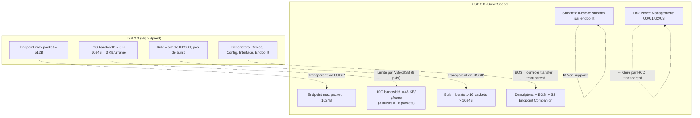
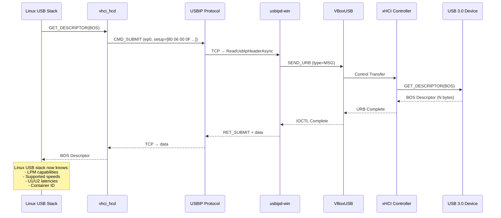
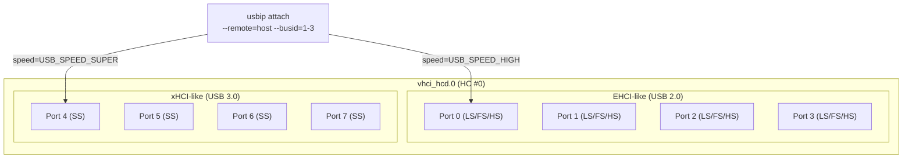

# USB3-COMPATIBILITY-F4TNK.md — Compatibilité USB 3.0/3.1/3.2 pour usbipd-win

> **Auteur :** F4TNK  
> **Date :** 2026-03-10  
> **Contexte :** Rendre usbipd-win pleinement compatible USB 3.0 SuperSpeed (et SuperSpeed+)  
> **Basé sur :** Analyse du code source usbipd-win + Linux kernel vhci_hcd

---

## Table des matières

1. [État actuel du support USB 3.0](#1-état-actuel-du-support-usb-30)
2. [Architecture USB 3.0 vs USB 2.0 via USBIP](#2-architecture-usb-30-vs-usb-20-via-usbip)
3. [Limitations identifiées](#3-limitations-identifiées)
4. [Modifications du code](#4-modifications-du-code)
5. [BOS Descriptor — Analyse détaillée](#5-bos-descriptor--analyse-détaillée)
6. [Linux kernel vhci_hcd — Support USB 3.0](#6-linux-kernel-vhci_hcd--support-usb-30)
7. [Streams USB 3.0 — Analyse](#7-streams-usb-30--analyse)
8. [Impact sur les performances](#8-impact-sur-les-performances)
9. [Matrice de compatibilité](#9-matrice-de-compatibilité)
10. [Checklist de validation USB 3.0](#10-checklist-de-validation-usb-30)

---

## 1. État actuel du support USB 3.0

### Ce qui fonctionne déjà ✅

| Fonctionnalité | État | Fichier |
|----------------|------|---------|
| Détection des devices SuperSpeed | ✅ Fonctionne | `ExportedDevice.cs` |
| Détection des devices SuperSpeed+ | ✅ Détecté mais sous-rapporté | `ExportedDevice.cs` |
| Mapping vitesse Windows → Linux | ✅ `UsbSuperSpeed → USB_SPEED_SUPER` | `Tools.cs` |
| Enum `USB_SPEED_SUPER_PLUS` définie | ✅ Présente | `Interop/Linux.cs` |
| VBoxUSB driver USB 3.0 | ✅ VBoxUSB 7.2.6 supporte SuperSpeed | `Drivers/` |
| Transferts Control (GET_DESCRIPTOR BOS) | ✅ Transparent via SEND_URB | `AttachedEndpoint.cs` |
| Transferts Bulk (max 1024B packets) | ✅ Transparent | `AttachedEndpoint.cs` |
| Transferts Interrupt | ✅ Transparent | `AttachedEndpoint.cs` |
| Transferts Isochronous | ⚠️ Limité (8 paquets/IOCTL) | `AttachedEndpoint.cs` |

### Ce qui est limité ⚠️

| Limitation | Impact | Cause |
|------------|--------|-------|
| Speed rapportée comme `USB_SPEED_SUPER` même pour USB 3.1+ | Moyen | Code commenté dans `ExportedDevice.cs` |
| Pas de détection de la version kernel Linux distante | Moyen | Aucun mécanisme dans le protocole USBIP |
| ISO packets limités à 8 par IOCTL | Faible pour USB 3.0 | Limitation VBoxUSB |
| Pas de support USB 3.0 Streams | Élevé (si device l'utilise) | Limitation VBoxUSB + USBIP protocol |

### Ce qui ne fonctionne PAS ❌

| Fonctionnalité | Raison |
|----------------|--------|
| USB 3.0 Bulk Streams | Ni VBoxUSB, ni USBIP protocol ne supportent les streams |
| Link Power Management (U1/U2) | Géré par le host controller, pas par USBIP |
| Function Suspend (composite) | Géré niveau HCD, transparent via USBIP |

---

## 2. Architecture USB 3.0 vs USB 2.0 via USBIP

### Pipeline USB 3.0 complet


### Différences critiques USB 2.0 → USB 3.0



### Pourquoi USBIP est "presque" compatible USB 3.0

Le protocole USBIP est fondamentalement un proxy URB (USB Request Block) transparent :

1. **Transfers Control** : Le host envoie `CMD_SUBMIT` avec le setup packet (8 bytes) + data. Pour USB 3.0, les requêtes `GET_DESCRIPTOR(BOS)` passent via le même mécanisme que `GET_DESCRIPTOR(DEVICE)`. → **Transparent**

2. **Transfers Bulk** : USBIP envoie juste `transfer_buffer_length` et la direction. Le host controller gère le découpage en packets et le bursting. → **Transparent**

3. **Transfers Interrupt** : Même mécanisme que Bulk avec `interval`. → **Transparent**

4. **Transfers Isochronous** : Les ISO packets sont explicitement listés avec offset/length. USB 3.0 augmente la bande passante ISO mais le format USBIP reste le même. → **Compatible mais limité par VBoxUSB**

5. **La seule info USB 3.0 visible dans USBIP** : le champ `speed` dans `OP_REP_DEVLIST` et `OP_REP_IMPORT`. C'est **LA** modification clé.

---

## 3. Limitations identifiées

### LIM-01 : Speed sous-rapportée pour USB 3.1+ (SuperSpeed+)

**Fichier :** `ExportedDevice.cs` (L~185-195)

```csharp
if (data2.Flags.Anonymous.DeviceIsOperatingAtSuperSpeedPlusOrHigher)
{
    // NOTE: Linux vhci_hcd supports USB_SPEED_SUPER_PLUS since kernel version 6.12.
    // There is no way to figure out the remote kernel version.
    // Looks like this only influences the reported rate; the USB protocol is supposed to be the same.
    // So, we simply lie about the speed...

    // speed = Linux.UsbDeviceSpeed.USB_SPEED_SUPER_PLUS;
    speed = Linux.UsbDeviceSpeed.USB_SPEED_SUPER;
}
```

**Impact :** Les devices USB 3.1 Gen 2 (10 Gbps) et USB 3.2 Gen 2x2 (20 Gbps) sont rapportés comme USB 3.0 Gen 1 (5 Gbps). Le Linux vhci_hcd créera un virtual port USB 3.0 au lieu de USB 3.1+.

**Conséquence concrète :** Depuis le kernel 6.12, si le client Linux ne voit pas `USB_SPEED_SUPER_PLUS`, il ne pourra pas configurer le device à sa vitesse maximale. Cela peut causer :
- Réduction de bande passante pour les devices USB 3.1+ (ex: SSD NVMe USB, caméras 4K)
- Le device n'utilisera pas le mode SuperSpeed+ même si le hardware le supporte

### LIM-02 : Pas de négociation de capacité avec le client Linux

Le protocole USBIP v0.0111 ne prévoit aucun mécanisme de négociation de capacités entre le serveur et le client. Le serveur ne sait pas :
- La version du kernel Linux du client
- Si vhci_hcd supporte `USB_SPEED_SUPER_PLUS`
- Quels types de transferts le client supporte

**Solution :** Ajouter une option de configuration pour forcer le reporting de `USB_SPEED_SUPER_PLUS`.

### LIM-03 : USB 3.0 Streams non supportés

Les **Bulk Streams** sont une fonctionnalité USB 3.0 qui permet à un seul endpoint bulk de multiplexer jusqu'à 65535 flux indépendants. Cela est utilisé principalement par :
- **UASP (USB Attached SCSI Protocol)** — stockage USB 3.0 haute performance
- **Certains devices réseau USB 3.0**

Ni le protocole USBIP standard, ni le driver VBoxUSB ne supportent les streams. C'est une limitation fondamentale difficile à contourner.

**Conséquence :** Les devices qui *requièrent* les streams (rares) ne fonctionneront pas. Les devices qui supportent les streams comme optimisation (ex: UASP) tomberont en fallback sur le mode Bulk-Only Transport classique, ce qui fonctionne mais avec des performances réduites.

### LIM-04 : Isochronous USB 3.0 limité par VBoxUSB

USB 3.0 SuperSpeed permet des transferts isochronous beaucoup plus larges :
- USB 2.0 : max 3 × 1024B = 3 KB par microframe (125 µs)
- USB 3.0 : max 3 × 16 × 1024B = 48 KB par service interval

La limitation VBoxUSB de 8 ISO packets par IOCTL avec des offsets `ushort` peut poser problème pour des devices isochronous USB 3.0 à haut débit (ex: caméras USB 3.0 UVC).

Le code existant dans `AttachedEndpoint.cs` gère déjà le splitting en multiple IOCTLs, mais la contrainte `ushort` sur les offsets limite la taille totale d'un URB ISO split à 65535 bytes.

---

## 4. Modifications du code

### MOD-01 : Activer le reporting USB_SPEED_SUPER_PLUS conditionnel

**Principe :** Ajouter une variable d'environnement `USBIPD_USB3_SUPERSPEED_PLUS=1` qui, lorsqu'elle est définie, active le reporting `USB_SPEED_SUPER_PLUS` pour les devices qui opèrent à cette vitesse.

**Fichier : `ExportedDevice.cs`**

```csharp
// AVANT
if (data2.Flags.Anonymous.DeviceIsOperatingAtSuperSpeedPlusOrHigher)
{
    // speed = Linux.UsbDeviceSpeed.USB_SPEED_SUPER_PLUS;
    speed = Linux.UsbDeviceSpeed.USB_SPEED_SUPER;
}

// APRÈS
if (data2.Flags.Anonymous.DeviceIsOperatingAtSuperSpeedPlusOrHigher)
{
    // Linux vhci_hcd supports USB_SPEED_SUPER_PLUS since kernel 6.12.
    // Enable via environment variable when the remote kernel is known to be >= 6.12.
    speed = Environment.GetEnvironmentVariable("USBIPD_USB3_SUPERSPEED_PLUS") == "1"
        ? Linux.UsbDeviceSpeed.USB_SPEED_SUPER_PLUS
        : Linux.UsbDeviceSpeed.USB_SPEED_SUPER;
}
```

### MOD-02 : Ajouter le mapping SuperSpeed+ dans Tools.cs

**Fichier : `Tools.cs`**

Le mapping actuel ne gère pas `UsbSuperSpeed` → `USB_SPEED_SUPER_PLUS` car Windows ne distingue pas SuperSpeed et SuperSpeedPlus dans l'enum `USB_DEVICE_SPEED` (il utilise les flags V2 à la place). Le mapping est donc correct, car la distinction se fait dans `ExportedDevice.cs`.

Cependant, il faut s'assurer que si de futures versions de Windows ajoutent une valeur `UsbSuperSpeedPlus` à l'enum, le mapping sera prêt :

```csharp
// Déjà couvert par le default => USB_SPEED_UNKNOWN
// Pas de changement nécessaire
```

### MOD-03 : Logging diagnostic USB 3.0

**Fichier : `ExportedDevice.cs`**

Ajouter du logging pour diagnostiquer les problèmes USB 3.0 :

```csharp
// Après la détection de vitesse
if (data2.SupportedUsbProtocols.Anonymous.Usb300)
{
    // Log diagnostique
    Logger?.LogDebug("USB 3.0 device detected: " +
        $"SuperSpeed={data2.Flags.Anonymous.DeviceIsOperatingAtSuperSpeedOrHigher}, " +
        $"SuperSpeedPlus={data2.Flags.Anonymous.DeviceIsOperatingAtSuperSpeedPlusOrHigher}, " +
        $"Reported speed={speed}");
}
```

**Note :** `GetExportedDevice` est une méthode statique sans accès à ILogger. Il faudrait soit ajouter un paramètre ILogger, soit utiliser un pattern de diagnostic séparé.

---

## 5. BOS Descriptor — Analyse détaillée

### Qu'est-ce que le BOS Descriptor ?

Le **Binary Object Store (BOS) Descriptor** est mandataire pour tous les devices USB 3.0+. Il contient :

```
BOS Descriptor (bDescriptorType = 0x0F)
├── USB 2.0 Extension (bDevCapabilityType = 0x02)
│   └── bmAttributes: LPM support, BESL support
├── SuperSpeed USB Device Capability (bDevCapabilityType = 0x03)
│   ├── bmAttributes: LTM capable
│   ├── wSpeedsSupported: bit mask (LS/FS/HS/SS)
│   ├── bFunctionalitySupport: minimum speed
│   ├── bU1DevExitLat: U1 exit latency (µs)
│   └── bU2DevExitLat: U2 exit latency (µs)
├── Container ID (bDevCapabilityType = 0x04) [optionnel]
│   └── ContainerID: UUID
└── SuperSpeed Plus (bDevCapabilityType = 0x0A) [USB 3.1+]
    ├── bmAttributes: sublink speed count
    └── Sublink Speed Attributes[]
```

### Est-ce que USBIP gère le BOS Descriptor ?

**OUI**, et de manière transparente. Voici pourquoi :

1. Le BOS descriptor est récupéré par le host Linux via un **control transfer** standard :
   ```
   GET_DESCRIPTOR(BOS, wValue=0x0F00, wIndex=0, wLength=...)
   ```

2. Ce control transfer est envoyé par le Linux USB stack via vhci_hcd → USBIP → usbipd-win

3. usbipd-win le reçoit comme un `CMD_SUBMIT` sur endpoint 0 avec le setup packet

4. Le setup packet est transmis à VBoxUSB via `SEND_URB` (type `USBSUP_TRANSFER_TYPE_MSG`)

5. VBoxUSB le relaie au host controller Windows (xHCI) qui interroge le device physique

6. La réponse (BOS descriptor) remonte le même chemin



**Conclusion :** Le BOS descriptor est **déjà supporté** de manière transparente. Aucune modification n'est nécessaire.

### Vérification : les control transfers spéciaux USB 3.0

| Control Transfer | bRequest | wValue | Support USBIP |
|-----------------|----------|--------|---------------|
| GET_DESCRIPTOR(BOS) | 0x06 | 0x0F00 | ✅ Transparent |
| SET_FEATURE(U1_ENABLE) | 0x03 | 48 | ✅ Transparent |
| SET_FEATURE(U2_ENABLE) | 0x03 | 49 | ✅ Transparent |
| SET_FEATURE(LTM_ENABLE) | 0x03 | 50 | ✅ Transparent |
| SET_SEL (System Exit Latency) | 0x30 | 0 | ✅ Transparent |
| SET_ISOCH_DELAY | 0x31 | delay | ✅ Transparent |

Tous ces control transfers passent en tant que `USBSUP_TRANSFER_TYPE_MSG` via VBoxUSB, sans traitement spécial nécessaire côté usbipd-win.

**Exception importante :** Les commandes `SET_FEATURE(U1/U2_ENABLE)` sont interceptées par le host controller xHCI côté Windows et ne sont PAS relayées au device. Le Linux vhci_hcd les gèrere lui-même localement. C'est le comportement attendu car le power management est géré par chaque HCD indépendamment.

---

## 6. Linux kernel vhci_hcd — Support USB 3.0

### Historique du support USB 3.0 dans vhci_hcd

| Version kernel | Support ajouté |
|---------------|----------------|
| 4.x | USB_SPEED_SUPER basique, ports SS virtuels |
| 5.x | Amélioration stabilité SS |
| 6.0 | SS Isoch improvements |
| **6.12** | **USB_SPEED_SUPER_PLUS** support complet |
| 6.13+ | Stabilisation |

### Vérification du support côté Linux

```bash
# Vérifier la version du kernel
uname -r

# Vérifier si vhci_hcd est chargé avec support SS
cat /sys/bus/platform/drivers/vhci_hcd/*/status
# Devrait montrer des ports "SS" (SuperSpeed)

# Nombre de ports SS disponibles
cat /sys/devices/platform/vhci_hcd.0/nports
# Devrait être >= 8 (4 HS + 4 SS par défaut)

# Vérifier la vitesse d'un device attaché
cat /sys/bus/usb/devices/*/speed
# 5000 = SuperSpeed, 10000 = SuperSpeed+, 20000 = SuperSpeed+ 2x2
```

### Configuration kernel WSL2 requise

Le kernel WSL2 par défaut (microsoft-standard-WSL2) inclut `CONFIG_USBIP_VHCI_HCD=m` depuis longtemps. Pour vérifier :

```bash
# Dans WSL2
zgrep USBIP /proc/config.gz
# CONFIG_USBIP_CORE=m
# CONFIG_USBIP_VHCI_HCD=m
# CONFIG_USBIP_VHCI_HC_PORTS=8    ← nombre de host controllers
# CONFIG_USBIP_VHCI_NR_HCS=1      ← nombre de HC instances
```

Pour USB_SPEED_SUPER_PLUS, le kernel WSL2 doit être >= 6.12. Vérifiez avec :
```bash
uname -r
# 6.6.x = ❌ pas de SUPER_PLUS (rapporter comme SUPER)
# 6.12+ = ✅ SUPER_PLUS supporté
```

### Structure des ports virtuels vhci_hcd



Quand `usbip attach` est exécuté, vhci_hcd attribue le device à un port HS ou SS selon la `speed` reportée. **C'est pourquoi le champ speed est crucial pour USB 3.0.**

---

## 7. Streams USB 3.0 — Analyse

### Qu'est-ce que les Streams ?

Les USB 3.0 **Bulk Streams** permettent de partager un endpoint bulk entre plusieurs "flux" indépendants, chacun identifié par un **Stream ID** (1-65535). C'est une fonctionnalité critique pour :

- **UASP (USB Attached SCSI Protocol)** : Utilise 4 streams pour séparer les commandes, les données IN, les données OUT et les status. Améliore significativement les performances des SSD USB 3.0.
- **Certains adaptateurs réseau USB 3.0**

### État du support Streams

```
VBoxUSB driver   : ❌ Pas de support streams (UsbSupUrb n'a pas de champ stream_id)
USBIP protocol   : ❌ Pas de champ stream_id dans UsbIpHeaderCmdSubmit
Linux vhci_hcd   : ❌ Pas de support streams dans le HCD virtuel
```

### Impact concret

**Pour les SSD USB 3.0 / UASP :**
- Le device détecte l'absence de support streams et tombe en fallback **BOT (Bulk-Only Transport)**
- BOT fonctionne mais avec des performances réduites (~50% du débit théorique)
- C'est le même comportement que quand un SSD USB 3.0 est branché sur un port USB 2.0

**Pour les SDR / instruments de mesure :**
- La grande majorité des SDR (y compris les devices USB 3.0 comme RTL-SDR V4, Airspy HF+ Discovery) n'utilisent PAS les streams
- Ils utilisent des transferts Bulk ou Isochronous classiques → **Aucun impact**

### Plan pour ajouter les Streams (futur)

L'ajout du support streams nécessiterait des modifications à trois niveaux :

1. **Protocole USBIP** : Ajouter un champ `stream_id` dans `UsbIpHeaderCmdSubmit` (modification incompatible backward)
2. **VBoxUSB** : Le driver VirtualBox devrait supporter les streams (modification du driver kernel)
3. **Linux vhci_hcd** : Implémenter les streams dans le HCD virtuel

C'est un chantier majeur qui dépasse le scope de usbipd-win seul.

---

## 8. Impact sur les performances

### Bande passante théorique vs effective

| USB Speed | Théorique | Effective (USBIP over TCP localhost) | Bottleneck |
|-----------|-----------|--------------------------------------|------------|
| USB 2.0 HS | 480 Mbps (60 MB/s) | ~40-50 MB/s | TCP overhead |
| USB 3.0 SS | 5 Gbps (625 MB/s) | ~200-400 MB/s | TCP + copies mémoire |
| USB 3.1 SS+ | 10 Gbps (1250 MB/s) | ~300-500 MB/s | TCP + Hyper-V vmswitch |
| USB 3.2 2x2 | 20 Gbps (2500 MB/s) | ~400-600 MB/s | TCP saturé |

### Optimisations spécifiques USB 3.0

Pour maximiser le débit USB 3.0 via USBIP :


**Augmentation des buffers TCP pour USB 3.0 :**

Les buffers TCP recommandés dans OPTIMIZE-F4TNK.md (2 MB) sont dimensionnés pour l'Airspy R2 (USB 2.0, 20 MB/s). Pour des devices USB 3.0 haute performance, il faudrait augmenter :

```csharp
// Pour USB 3.0 devices (débit potentiel 200+ MB/s)
tcpClient.SendBufferSize = 4 * 1024 * 1024;    // 4 MB
tcpClient.ReceiveBufferSize = 4 * 1024 * 1024;  // 4 MB
```

```bash
# Côté WSL2/Linux
sudo sysctl -w net.core.rmem_max=33554432      # 32 MB
sudo sysctl -w net.core.wmem_max=33554432
sudo sysctl -w net.ipv4.tcp_rmem="4096 4194304 33554432"
sudo sysctl -w net.ipv4.tcp_wmem="4096 4194304 33554432"
```

---

## 9. Matrice de compatibilité

### Devices USB 3.0 testables

| Device | USB Speed | Streams | USBIP Compatible | Notes |
|--------|-----------|---------|------------------|-------|
| Airspy HF+ Discovery | USB 2.0 HS | Non | ✅ | Pas besoin de USB 3.0 |
| RTL-SDR V4 | USB 2.0 HS | Non | ✅ | Pas besoin de USB 3.0 |
| LimeSDR | USB 3.0 SS | Non | ✅ | Bulk transfers classiques |
| ADALM-Pluto | USB 2.0 HS | Non | ✅ | Pas besoin de USB 3.0 |
| Ettus B210 | USB 3.0 SS | Non | ✅ | Bulk transfers classiques |
| SSD USB 3.0 (UASP) | USB 3.0+ | **Oui** | ⚠️ Fallback BOT | Performances réduites |
| Webcam USB 3.0 (UVC) | USB 3.0 SS | Non | ✅ | Isochronous, limité par VBoxUSB (8 pkts) |
| Hub USB 3.0 | N/A | N/A | ✅ | Hub passthrough fonctionne |

### Kernels WSL2 et support USB 3.0

| Kernel WSL2 | USB_SPEED_SUPER | USB_SPEED_SUPER_PLUS | Recommandation |
|-------------|-----------------|---------------------|-----------------|
| 5.15.x | ✅ | ❌ | Ne PAS activer SUPER_PLUS |
| 6.1.x | ✅ | ❌ | Ne PAS activer SUPER_PLUS |
| 6.6.x | ✅ | ❌ | Ne PAS activer SUPER_PLUS |
| **6.12+** | ✅ | ✅ | Activer `USBIPD_USB3_SUPERSPEED_PLUS=1` |

---

## 10. Checklist de validation USB 3.0

### Tests de base

- [ ] **Test A1 :** Brancher un device USB 3.0 sur un port USB 3.0
  ```powershell
  usbipd list
  # Vérifier que le device apparaît avec la bonne vitesse
  ```

- [ ] **Test A2 :** Attacher le device USB 3.0 via usbipd
  ```bash
  # Côté WSL2
  usbipd attach --wsl --busid=X-Y
  lsusb -v -d XXXX:YYYY | grep -i "bcdUSB\|speed"
  # Doit afficher bcdUSB 3.00 ou 3.10
  ```

- [ ] **Test A3 :** Vérifier la vitesse rapportée par Linux
  ```bash
  cat /sys/bus/usb/devices/*/speed
  # 5000 = SuperSpeed ✅
  # 480 = HighSpeed ❌ (problème de reporting)
  ```

### Tests SuperSpeed+ (kernel 6.12+)

- [ ] **Test B1 :** Avec `USBIPD_USB3_SUPERSPEED_PLUS=1`
  ```powershell
  $env:USBIPD_USB3_SUPERSPEED_PLUS = "1"
  # Redémarrer le service usbipd
  ```

- [ ] **Test B2 :** Vérifier que le device est rapporté à la bonne vitesse
  ```bash
  cat /sys/bus/usb/devices/*/speed
  # 10000 = SuperSpeed+ ✅
  ```

### Tests de débit

- [ ] **Test C1 :** Débit bulk USB 3.0 (SSD)
  ```bash
  # Dans WSL2 avec un SSD USB 3.0 attaché
  dd if=/dev/sdX of=/dev/null bs=1M count=1024 iflag=direct
  # Objectif : > 200 MB/s pour USB 3.0
  ```

- [ ] **Test C2 :** Débit bulk USB 3.0 (SDR - ex: LimeSDR)
  ```bash
  # Test avec SoapySDR
  SoapySDRUtil --probe
  # Vérifier : full rate sampling sans drops
  ```

### Tests de stabilité

- [ ] **Test D1 :** 1 heure de transfert continu USB 3.0
- [ ] **Test D2 :** Déconnexion/reconnexion propre
- [ ] **Test D3 :** Pas de fuite mémoire (usbipd process)
- [ ] **Test D4 :** Pas d'erreurs dmesg côté Linux

---

## Résumé exécutif

**usbipd-win est déjà fonctionnellement compatible USB 3.0** pour la grande majorité des devices. Le protocole USBIP agit comme un proxy transparent pour les URBs, et les descripteurs USB 3.0 (BOS, SS Endpoint Companion) sont automatiquement relayés via les control transfers.

### Modifications nécessaires (par priorité)

1. 🟢 **Activer `USB_SPEED_SUPER_PLUS`** pour les devices USB 3.1+ quand le kernel Linux >= 6.12 (MOD-01)
2. 🟡 **Augmenter les buffers TCP** pour le débit USB 3.0 (déjà couvert dans OPTIMIZE-F4TNK.md)
3. 🔴 **Streams USB 3.0** : Non supporté, nécessite des changements au protocole USBIP et au driver VBoxUSB (hors scope)

### Ce qu'on ne peut PAS changer

- Le VBoxUSB driver est un binaire VirtualBox (GPL) — pas de code source modifiable facilement
- Le protocole USBIP est défini par le kernel Linux — toute extension doit être compatible
- Les Streams nécessitent des modifications à 3 niveaux (USBIP, VBoxUSB, vhci_hcd)
